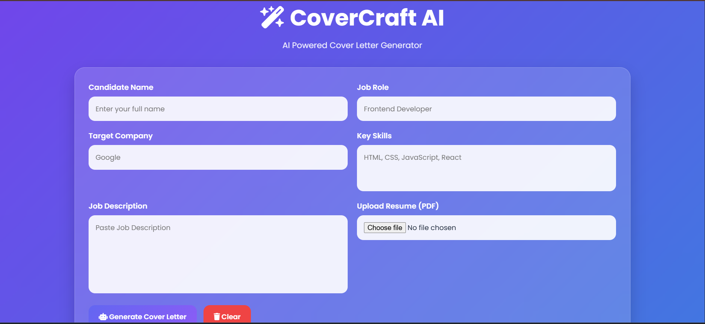
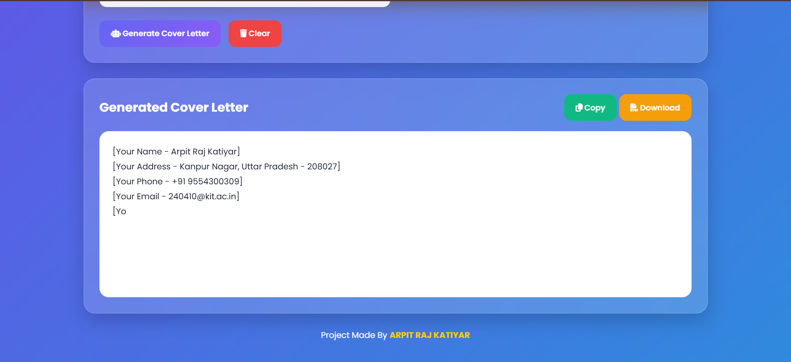
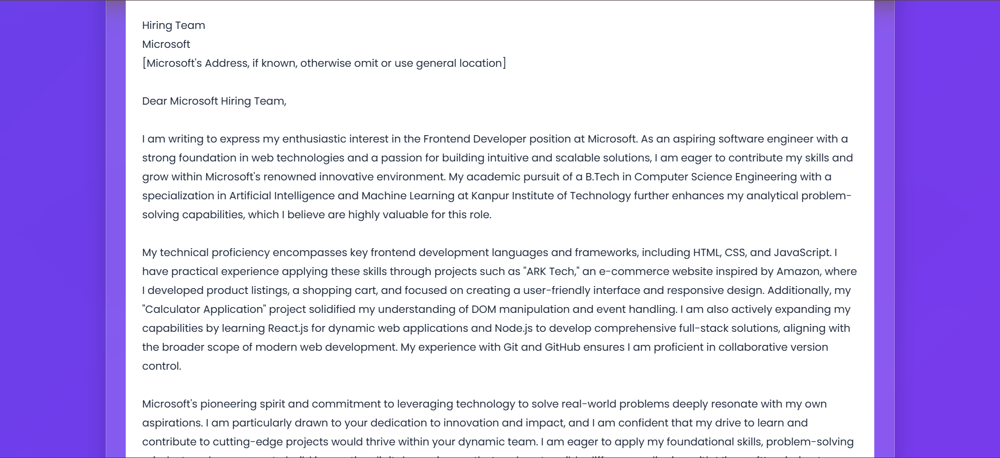
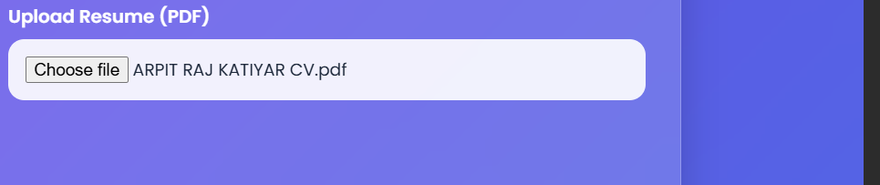
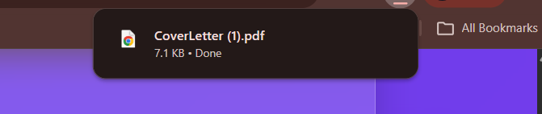
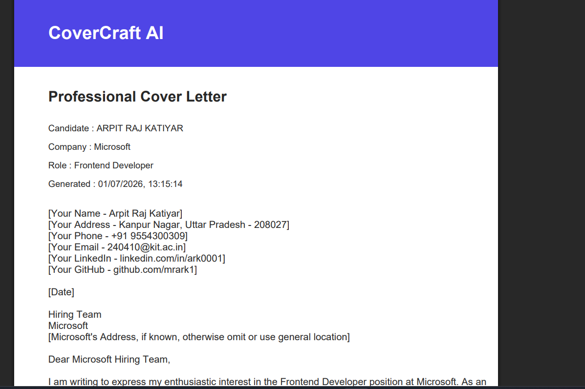
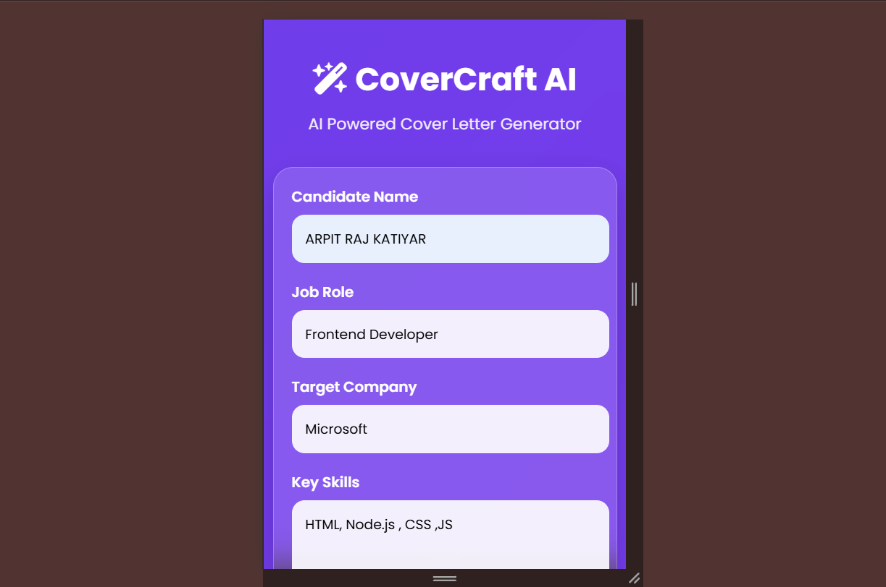
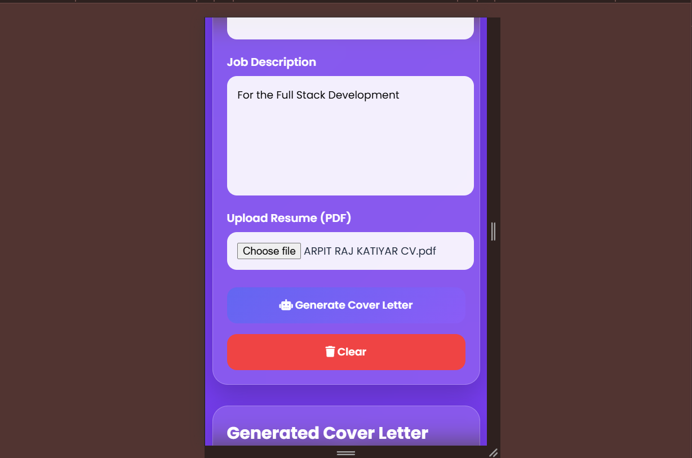
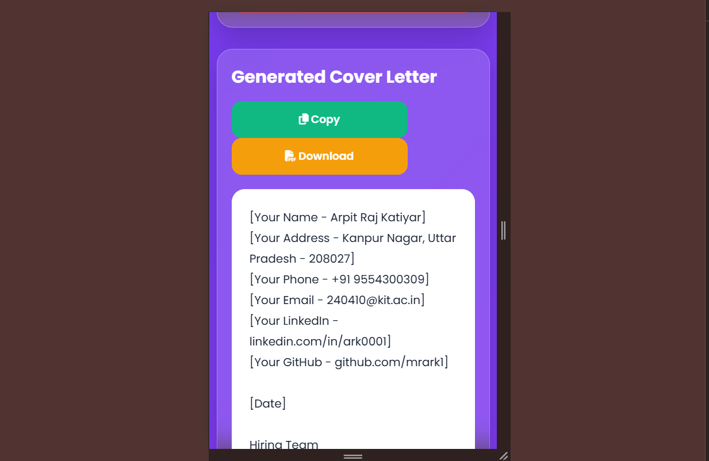

# 🚀 CoverCraft AI

<div align="center">

## AI Powered Cover Letter Generator

Generate professional, ATS-friendly cover letters using **Google Gemini AI**.

Developed for **Prodesk IT Internship – Sprint 04**

</div>

---

## 📌 Overview

CoverCraft AI is a modern AI-powered web application that helps job seekers generate professional cover letters in seconds.

The application uses **Google Gemini AI** to create personalized, ATS-friendly cover letters based on:

* Candidate Information
* Job Role
* Target Company
* Technical Skills
* Job Description
* Uploaded Resume (PDF)

---

### ✨ Features

## ✅ Sprint Phase 1

* Candidate Information Form
* Job Role Input
* Company Name Input
* Skills Input
* Generate Cover Letter
* Copy to Clipboard

---

## ✅ Sprint Phase 2

* Google Gemini AI Integration
* Express Backend
* Secure API Key using `.env`
* Loading Animation
* Error Handling
* Professional Prompt Engineering

---

## ✅ Sprint Phase 3

* Resume PDF Upload
* Resume Text Extraction
* Personalized Cover Letter Generation
* ATS-Friendly AI Output

---

### 🌟 Premium Features

* Glassmorphism UI
* Responsive Design
* Copy Cover Letter
* Download as PDF
* Resume Upload
* AI Typing Animation
* Professional PDF Export
* Clean User Interface

---

### 🛠 Tech Stack

### Frontend

* HTML5
* CSS3
* Vanilla JavaScript

### Backend

* Node.js
* Express.js

### AI

* Google Gemini API

### Packages

* Express
* Multer
* pdf-parse
* dotenv
* CORS
* @google/genai
* jsPDF

---

### 📂 Folder Structure

```text
covercraft-ai/
│
├── client/
│   ├── index.html
│   ├── style.css
│   ├── script.js
│   └── assets/
│
├── server/
│   ├── server.js
│   ├── routes/
│   ├── controllers/
│   ├── middleware/
│   ├── uploads/
│   ├── package.json
│   ├── .env
│   └── .gitignore
│
├── README.md
├── Prompts.md
└── docs/
```

---

### ⚙️ Installation

## Clone Repository

```bash
git clone https://github.com/mrark1/covercraft-ai.git
```

## Install Backend Dependencies

```bash
cd server
npm install
```

## Create `.env`

```env
GEMINI_API_KEY=YOUR_GEMINI_API_KEY
PORT=5000
```

## Run Backend

```bash
npm run dev
```

## Run Frontend

Open `client/index.html` using Live Server.

---

## 🌐 API Used

Google Gemini API

Model: gemini-2.5-flash


## 📸 Screenshots

Add screenshots in:

```text
client/assets/screenshots/
```

Suggested screenshots:

* Home Screen
 

* Generated Cover Letter  



* Resume Upload


* PDF Download




* Mobile View




---

### 🚀 Future Improvements

* Multiple AI Writing Styles
* DOCX Export
* Cover Letter Templates
* User Authentication
* Cloud Storage
* Dashboard
* Cover Letter History

---

## 👨‍💻 Developed By

ARPIT RAJ KATIYAR

B.Tech CSE (AI & ML)

Kanpur Institute of Technology

---

### 🎯 Internship

Developed as part of Prodesk IT Internship - Sprint 04

---

### 📄 License

This project is created for educational and internship purposes.

## Live Deploymemnmt 
<https://covercraft-ai-delta.vercel.app/>
